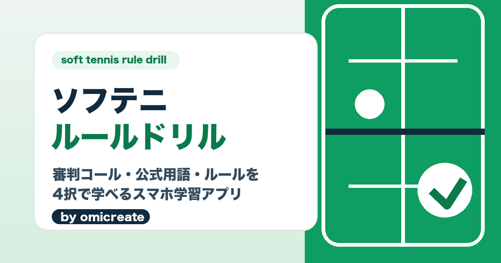

# ソフテニルールドリル



小学生・中学生、ソフトテニス初心者、初めてジュニア審判をする人向けのスマホ用4択ドリルアプリです。

### 今すぐ試す: https://omicreate.github.io/soft-tennis-rule-drill/

インストール不要。スマホのブラウザで開けばそのまま使えます（ホーム画面に追加するとアプリのように起動できます）。

現在の表示バージョン: `v1.0.3`

## 利用条件

このリポジトリおよびアプリの著作権は omicreate に帰属します。
許可なく、コード・画面・設計書・画像・文言の転載、再配布、改変利用、販売、第三者サービスへの組み込みを行うことを禁じます。

詳しくは `TERMS.md`、`PRIVACY.md`、`SECURITY.md` を確認してください。

## できること

- 150問の4択ドリルをシャッフル出題
- 公式用語と初心者向け解説を表示
- ドリルの学習記録
- 間違えた問題の復習
- 試合前のトスや暑さ対策は、基本確認として少なめに出題
- オフラインでも開けるPWA（ホーム追加用アイコン・favicon付き）

## ルール確認方針

このアプリは公式認定アプリではありません。表示は「公式資料・連盟資料を確認して作成」に留め、公式ロゴや公式認定を思わせる表示は使いません。

基本的なルール練習としてできるだけ正確に作っていますが、大会や当日のルールで扱いが変わることがあります。実際の試合では、当日の審判委員・大会要項・競技上の注意の指示を優先してください。

## デザイン方針

- ボールは無地の丸だけを使う
- 硬式テニス風の曲線入りボール、フェルト質感、テニスボール絵文字は使わない
- ソフトテニスのコート、審判、採点票、コールを中心に表現する

## ローカル確認

```sh
cd /Users/omi/Documents/SoftTennis/soft-tennis-rule-drill
npm test
python3 -m http.server 8000
```

確認URL:

```text
http://127.0.0.1:8000/index.html
```

## 公開想定

GitHub Pages:

```text
https://omicreate.github.io/soft-tennis-rule-drill/
```

公開前に `docs/update-rules.md` の確認手順で出典を見直してください。
